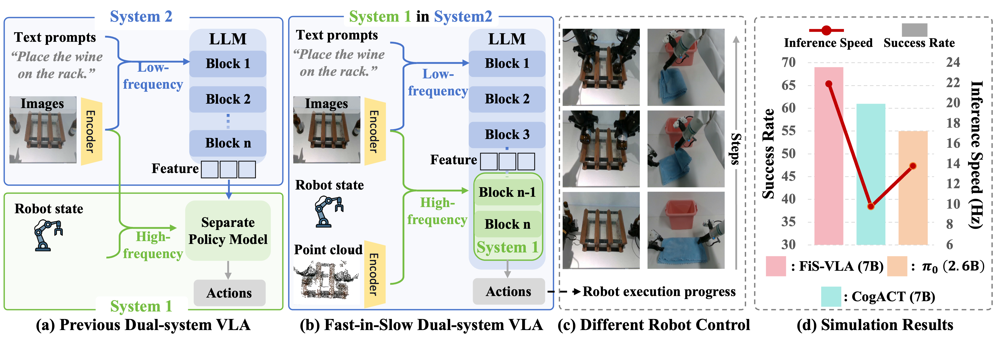

<div align="center">

# Fast-in-Slow: A Dual-System Foundation Model Unifying Fast Manipulation within Slow Reasoning


[🌐**Project Page**](https://fast-in-slow.github.io/) | [🎥**Demo**](https://fast-in-slow.github.io/)

Hao Chen, Jiaming Liu, Chenyang Gu, Zhuoyang Liu, Renrui Zhang, Xiaoqi Li, Xiao He, Yandong Guo, 
Chi-Wing Fu, Shanghang Zhang, Pheng-Ann Heng

</div>



**🤖 Unlike previous dual-system VLA methods that attach a separate policy head as System 1, FiS-VLA repurposes the final transformer blocks of an intact VLM as System 1, while retaining the full model for System 2 reasoning.** Our System 2 processes low-frequency 2D images and language prompts into latent features that guide System 1, while System 1 additionally handles high-frequency inputs, including the robot state, 2D images, and point clouds, for robust and responsive action generation. Under this paradigm, FiS-VLA achieves superior performance and high-frequency control.


## ✨ News ✨
- [2025/06/03] Fast-in-Slow is now live on arXiv with code release! 🚀 


## 📦 Installation

The code is built using Python 3.10, we also recommand to use Python above Python 3.10. We require PyTorch >= 2.2.0 and CUDA >= 12.0 (It may run with lower versions, but we have not tested it).
We recommend using [Miniconda](https://docs.conda.io/en/latest/miniconda.html) and create an environment as follows:

```bash
conda create --name fisvla python=3.10
conda activate fisvla

cd Fast-in-Slow
pip install -r requirement.txt
pip install git+https://github.com/moojink/dlimp_openvla@040105d256bd28866cc6620621a3d5f7b6b91b46
pip install git+https://github.com/arnoldland/openvla@5603207085d55148682e2a35b868ad77d7b42ece
pip install "git+https://github.com/facebookresearch/pytorch3d.git@stable"

# Training additionally requires Flash-Attention 2 (https://github.com/Dao-AILab/flash-attention)
pip install packaging ninja

# Verify Ninja --> should return exit code "0"
ninja --version; echo $?

# Install Flash Attention 2
# =>> If you run into difficulty, try `pip cache remove flash_attn` first
pip install "flash-attn==2.5.5" --no-build-isolation

export COPPELIASIM_ROOT=${HOME}/CoppeliaSim
export LD_LIBRARY_PATH=$LD_LIBRARY_PATH:$COPPELIASIM_ROOT
export QT_QPA_PLATFORM_PLUGIN_PATH=$COPPELIASIM_ROOT

wget https://downloads.coppeliarobotics.com/V4_1_0/CoppeliaSim_Edu_V4_1_0_Ubuntu20_04.tar.xz
mkdir -p $COPPELIASIM_ROOT && tar -xf CoppeliaSim_Edu_V4_1_0_Ubuntu20_04.tar.xz -C $COPPELIASIM_ROOT --strip-components 1
rm -rf CoppeliaSim_Edu_V4_1_0_Ubuntu20_04.tar.xz

cd LIFT3D/third_party/RLBench
pip install -e .
cd ../../..

cd LIFT3D
pip install -e .
cd ..

pip install --force-reinstall opencv-python-headless
pip install numpy==1.26.4
```

## 🧩 Framework

Our code is built based on [HybridVLA](https://github.com/PKU-HMI-Lab/Hybrid-VLA) and [Lift3D](https://github.com/PKU-HMI-Lab/LIFT3D) and is organized in the following framework:

- `conf`: config files for hydridvla training
- `scripts`: scripts for training and testing
- `training`: contains strategies for training
- `models`: contains Fast-in-Slow models, including backbones & diffusion & vlms & vlas
- `util`: contains different kinds of tools funtion
- `vla`: from openvla's vla structure, including action tokenizer, etc.
- `transformer`: customized transformer package
- `timm`: customized timm package

## 💡Getting Started

See the ``train.sh`` and ``scripts/train.py`` for more training details.

See the ``test_rlbench.sh`` and ``scripts/sim.py`` for more testing details.

## 📜️ License

This project is licensed under the MIT License - see the [LICENSE](LICENSE) file for details.